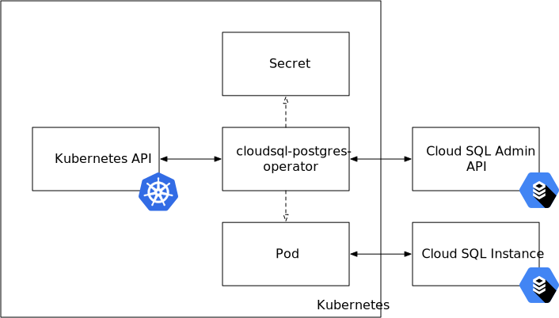
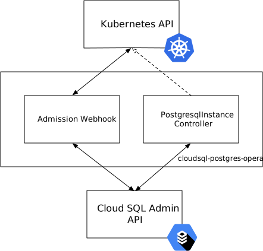

:icons: font
:sectnums!:
:toc: macro
:toc-title:
:toclevels: 3
ifdef::env-github[]
:caution-caption: :fire:
:important-caption: :heavy_exclamation_mark:
:note-caption: :information_source:
:tip-caption: :bulb:
:warning-caption: :warning:
endif::[]

= `cloudsql-postgres-operator`: Design Overview

[discrete]
== Table of Contents
toc::[]

== Introduction

`cloudsql-postgres-operator` is a Kubernetes https://coreos.com/operators/[operator] designed to manage Cloud SQL for PostgreSQL, from now on referred to _CSQLP_, instances atop Kubernetes, automating their creation and administration.
Management of CSQLP instances is performed using a https://kubernetes.io/docs/concepts/extend-kubernetes/api-extension/custom-resources/[custom resource] defined as part of the <<api,`cloudsql-postgres-operator` API>>.

The sections below outline the goals and non-goals set forth for `cloudsql-postgres-operator`, provide a detailed description of its API, and provide insight on some aspects that govern the actual implementation.

NOTE: This document is intended as a living document, and will be updated as required during the lifecycle of `cloudsql-postgres-operator` in order to reflect the latest design decisions and their implementation.

== Goals

The following features represent goals for `cloudsql-postgres-operator`:

* Create, update and delete https://cloud.google.com/sql/docs/postgres/[CSQLP] instances from within Kubernetes.
** Manage instances within the context of a single Google Cloud Platform project.
** Allow for configuring the desired instance name, instance type, and disk size and type.
** Allow for configuring the https://cloud.google.com/sql/docs/postgres/locations[location] (region and zone) and https://cloud.google.com/sql/docs/postgres/high-availability[availability type].
** Allow for configuring the schedule for the https://cloud.google.com/sql/docs/postgres/instance-settings#maintenance-window-2ndgen[weekly maintenance] and for the https://cloud.google.com/sql/docs/postgres/backup-recovery/backups[daily backups].
** Allow for configuring the https://cloud.google.com/sql/docs/postgres/connect-external-app[networking settings].
** Prevent accidental deletion of a given instance.
* Automatically inject the https://cloud.google.com/sql/docs/mysql/sql-proxy[Cloud SQL proxy] and the required connection details in pods requesting access to a CSQLP instance managed by `cloudsql-postgres-operator`, regardless of whether the instance is publicly accessible or not.

== Non-goals

The following features represent non-goals for `cloudsql-postgres-operator`:

* Manage CSQLP instances across multiple Google Cloud Platform projects.
* Backup or restore a given CSQLP instance, given <<on-demand-backup-and-restore-operations,the following limitations>>.
* Create, update, delete and otherwise manage CSQLP https://cloud.google.com/sql/docs/postgres/replication/[read replicas].
* Perform operations such as failover/failback and TLS rotation.
* Create, update and delete databases inside a given CSQLP instance.
* Manage https://cloud.google.com/sql/docs/mysql/[Cloud SQL for MySQL] instances.

NOTE: These operations can still be performed using the Google Cloud Console, the `gcloud` CLI or the https://cloud.google.com/sql/docs/postgres/admin-api/v1beta4/[Cloud SQL Admin API].

NOTE: Some of these non-goals may (or may not) become goals in the future.

[[api]]
== The `cloudsql-postgres-operator` API

`cloudsql-postgres-operator` introduces the following https://kubernetes.io/docs/concepts/extend-kubernetes/api-extension/custom-resources/[custom resource] as part of the `cloudsql.travelaudience.com/v1alpha1` API:

* <<postgresqlinstance,`PostgresqlInstance`>>

[[postgresqlinstance]]
=== `PostgresqlInstance`

The `PostgresqlInstance` custom resource represents the desired state for a single CSQLP instance.
It is a _cluster-scoped_ resource, meaning that it does not exist inside a specific namespace.

==== Lifecycle

Creating a `PostgresqlInstance` resource causes `cloudsql-postgres-operator` to create a CSQLP instance following the provided specification.
If a CSQLP instance with the specified name already exists, and `cloudsql-postgres-operator` <<naming,is able to detect this>>, creation of the `PostgresqlInstance` resource is rejected upfront by an https://kubernetes.io/docs/reference/access-authn-authz/extensible-admission-controllers/[admission webhook].
When a CSQLP instance is created, `cloudsql-postgres-operator` generates a random password for the `postgres` https://cloud.google.com/sql/docs/postgres/users[PostgreSQL user] and creates a https://kubernetes.io/docs/concepts/configuration/secret/[secret] in the `cloudsql-postgres-operator` namespace containing it (as well as additional connection details).
This secret is intended to be used exclusively by `cloudsql-postgres-operator`, and will later be replicated as required into namespaces where pods requiring access to the CSQLP instance are created.

[IMPORTANT]
====
Changing the password for the `postgres` user from the randomly-generated value to a different one is not supported.
Furtermore, any "out-of-band" changes to this password will cause `cloudsql-postgres-operator` and pods to be unable to connect to the CSQLP instance.
====

Updating a `PostgresqlInstance` resource causes `cloudsql-postgres-operator` to update the CSQLP instance according to the provided specification.
It should be noted that not all supported fields can be updated after the resource has been created.
Invalid updates are rejected upfront by the aforementioned admission webhook.

Deleting a `PostgresqlInstance` resource causes `cloudsql-postgres-operator` to delete the CSQLP instance targeted by said resource, as well as all secrets (across all namespaces) containing connection details for the instance.
However, and in order to prevent accidental deletion, the `PostgresqlInstance` resource must be annotated with the following annotation:

[source,text]
----
cloudsql.travelaudience.com/allow-deletion: "true"
----

If this annotation is not present, or if its value differs from `true`, deletion of the `PostgresqlInstance` resource (and hence of the associated Cloud SQL for PostreSQL instance) is rejected upfront by the aforementioned admission webhook.

`cloudsql-postgres-operator` periodically checks for differences between the specification provided by a given `PostgresqlIntance` resource and the status of the CSQLP instance.
The amount of time between successive checks can be tweaked in order to avoid <<quotas-limits-error-handling,quota exhaustion>>.
If differences are detected (either because the `PostgresqlInstance` resource has been modified, or because the CSQLP instance has been modified manually out-of-band), `cloudsql-postgres-operator` updates the instance based on the specification provided by the most recent version of the `PostgresqlInstance` resource.

==== Specification

The `PostgresqlInstance` resource supports the following fields under `.spec`:

|===
| Field | Description | Type | Observations

4+| *Availability*

| `.availability.type`
| The availability type of the instance.
| `string`
a|
* **Default:** `Zonal`.
* Must be one of `Zonal` or `Regional`.
* `Regional` means that https://cloud.google.com/sql/docs/postgres/high-availability[high availability] is enabled.

4+| *Daily Backups*

| `.backups.daily.enabled`
| Whether daily backups are enabled for the instance.
| `boolean`
a|
* **Default:** `true`.

| `.backups.daily.startTime`
| The start time (in UTC) for the daily backups of the instance, in 24-hour format.
| `string`
a|
* **Default:** `00:00`.
* Must represent a valid hour in 24-hour format (i.e. `hh:00`).

4+| **Database flags**

| `.flags`
| A list of flags passed to the instance.
| `[]string`
a|
* **Default:** Empty.
* Every flag must be provided in the format `<name>=<value>`.

4+| **User-defined labels**

| `.labels`
| A map of user-defined labels to be set on the instance.
| `object`
a|
* **Default:** Empty.
* Keys and values must be strings.
* A label with key `owner` and value `cloudsql-postgres-operator` is automatically added.
* Unrelated to `.metadata.labels`.

4+| **Geographical location**

| `.location.region`
| The region where the instance is located.
| `string`
a|
* **Default:** `europe-west1`.
* **Immutable**.
* Supported values are listed in https://cloud.google.com/sql/docs/postgres/instance-locations[this page].

| `.location.zone`
| The zone where the instance is located.
| `string`
a|
* **Default:** `Any`.
* Supported values are `Any` and zones listed in https://cloud.google.com/sql/docs/postgres/instance-locations[this page].
* For highly-available instances, this affects only the primary instance.

4+| **Maintenance**

| `.maintenance.day`
| The preferred day of the week for periodic maintenance of the instance.
| `string`
a|
* **Default:** `Any`.
* Must be equal to `Any` or represent a weekday (`Monday`, `Tuesday`, ...).

| `.maintenance.hour`
| The preferred hour of the day (in UTC) for periodic maintenance of the instance, in 24-hour format.
| `string`
a|
* **Default:** `Any` if `.spec.maintenance.day` is `Any`, `04:00` otherwise.
* Must be equal to `Any` or represent a valid hour in 24-hour format (i.e. `hh:00`).
* May be equal to `Any` _if and only if_ `.spec.maintenance.day` is `Any` as well.

4+| **Naming**

| `.name`
| The name of the instance.
| `string`
a|
* **Mandatory**.
* **Immutable**.
* Must match `^[a-z][a-z0-9-]+[a-z0-9]$`.
* Cannot exceed 97 characters when combined with the GCP project ID.

4+| **Networking**

| `.networking.privateIp.enabled`
| Whether the instance is accessible via a private IP address.
| `boolean`
a|
* **Default:** `false`.
* Cannot be changed back to `false` once set to `true`.
* Cannot be `false` if `.networking.publicIp.enabled` is `false`.

| `.networking.privateIp.network`
| The resource link of the VPC network from which the instance is accessible via a private IP address.
| `string`
a|
* **Default:** Empty.
* Must not be empty if `.networking.privateIp.enabled` is `true`.
* May be added and modified, but not removed.
* If not empty, must be a valid resource link in the `projects/<project-id>/global/networks/<network-name>` format.

| `.networking.publicIp` `.authorizedNetworks[*].cidr`
| The CIDR which to authorize by the current rule.
| `string`
a|

| `.networking.publicIp` `.authorizedNetworks[*].name`
| The name of the current rule.
| `string`
a|
* **Default:** Empty.

| `.networking.publicIp.enabled`
| Whether the instance is accessible via a public IP address.
| `boolean`
a|
* **Default:** `false`.
* Must not be `false` if `.networking.privateIp.enabled` is `false`.

4+| *Resources*

| `.resources.disk.sizeMaximumGb`
| The maximum size (in GB) to which the storage capacity of the instance can be automatically increased.
| `int32`
a|
* **Default:** `0`.
* Must be `0` or a positive integer greater than or equal to `.resources.disk.sizeMinimumGb`.
* When set to `0`, automatic resizing uses up to the maximum available storage for the instance.
* When set to the same value as `.resources.disk.sizeMinimumGb`, automatic resizing is disabled.

| `.resources.disk.sizeMinimumGb`
| The minimum size (in GB) requested for the storage capacity of the instance.
| `int32`
a|
* **Default:** `10`.
* Must be less than or equal to `.resources.disk.sizeMaximumGb`.
* May be increased in order to increase storage capacity, but not decreased.
* **MAY NOT** represent the _current_ storage capacity (but always represents a lower bound on said value).

| `.resources.disk.type`
| The type of disk used for storage by the instance.
| `string`
a|
* **Default:** `SSD`.
* **Immutable**.
* Must be one of `SSD` or `HDD`.

| `.resources.instanceType`
| The https://cloud.google.com/sql/docs/postgres/create-instance[instance type] to use for the instance.
| `string`
a|
* **Default:** `db-custom-1-3840` (meaning 1 vCPU and 3.75GB RAM).
* Must be one of `db-f1-micro` or `db-g1-small`, or follow the format `db-custom-<vCPUs>-<RAM>`.
* The values of `<vCPUs>` and `<RAM>` must be chosen according to https://cloud.google.com/sql/docs/postgres/create-instance[this set of rules].

4+| **Version**

| `.version`
| The database engine type and version.
| `string`
a|
* **Default:** `9.6`.
* **Immutable**.
* Currently, the only possible value is `9.6`.

|===

==== Example

An example of a valid `PostgresqlInstance` resource is provided below:

[[postgresqlinstance-example]]
[source,yaml]
----
apiVersion: cloudsql.travelaudience.com/v1alpha1
kind: PostgresqlInstance
metadata:
  name: postgresql-instance-0
spec:
  availability:
    type: Regional
  backups:
    daily:
      enabled: true
      startTime: "22:00"
  flags:
  - autovacuum=on
  labels:
    owner: cloudsql-postgres-operator
  location:
    region: europe-west4
    zone: europe-west4-b
  maintenance:
    day: Saturday
    hour: "16:00"
  name: cloudsql-psql-123456
  networking:
    privateIp:
      enabled: true
      network: projects/cloudsql-postgres-operator-123456/global/networks/default
    publicIp:
      authorizedNetworks:
      - cidr: 30.60.90.120/32
        name: alice
      - cidr: 120.90.60.0/24
        name: bob
      enabled: true
  resources:
    disk:
      size:
        maximumGb: 40
        minimumGb: 20
      type: SSD
    instanceType: db-custom-2-7680
  version: 9.6
----

Creating said resource causes `cloudsql-postgres-operator` to provision a CSQLP instance named `cloudsql-psql-123456` and having with the following configuration:

* 2 vCPUs, 7.5GB RAM, and a 20GB SSD disk which may be automatically resized up to 40GB.
* Located on the `europe-west-4b` zone, having high-availability enabled.
* Accessible via a private IP on the `default` VPC of the `cloudsql-postgres-operator-123456` project.
* Accessible via a public IP from `30.60.90.120` and from every IP in the `120.90.60.0/24` network.
* May undergo weekly maintenance on Saturdays, starting at 16:00 UTC.
* Has daily backups enabled and performed everyday, starting at 22:00 UTC.
* Runs PostgreSQL 9.6.

The instance may be referenced from within Kubernetes as `postgresql-instance-0` (i.e. the value of `.metadata.name`).

[[connecting]]
== Connecting to a CSQLP instance

In a typical scenario, connecting to a CSQLP instance from within a Kubernetes cluster is done using the https://cloud.google.com/sql/docs/postgres/sql-proxy[Cloud SQL proxy], as well as a PostgreSQL username and the corresponding password.
footnote:[For further information, please refer to https://cloud.google.com/sql/docs/postgres/connect-kubernetes-engine[Connecting from Google Kubernetes Engine].]
This requires the following items to be manually configured by the cluster administrator:

* A secret containing the credentials for an https://cloud.google.com/iam/docs/service-accounts[IAM service account] with the `roles/cloudsql.client` role;
** This secret is to be mounted into a https://kubernetes.io/docs/concepts/workloads/pods/pod-overview/#understanding-pods[sidecar container] that runs the Cloud SQL proxy.
* A secret containing the PostgreSQL username and password for the CSQLP instance;
** This secret is to be mounted into every container requiring access to PostgreSQL.

In order to reduce the burden of manually configuring secrets and pods, `cloudsql-postgres-operator` supports _automatic injection_ of the Cloud SQL proxy and of the required PostgreSQL credentials in pods requiring access to a given CSQLP instance.
Injection is performed using an https://kubernetes.io/docs/reference/access-authn-authz/extensible-admission-controllers/[_admission webhook_] that acts upon `Pod` resources being _created_ (but not _updated_) by modifying their https://kubernetes.io/docs/reference/generated/kubernetes-api/v1.13/#podspec-v1-core[`PodSpec`] as required.
In order to request automatic injection of the Cloud SQL proxy sidecar and of the connection details, pods requiring access to a given CSQLP instance managed by `cloudsql-postgres-operator` need only to specify the following annotation:

[source,text]
----
cloudsql.travelaudience.com/postgresqlinstance-name: "<postresqlinstance-name>"
----

WARNING: `<postgresqlinstance-name>` represents the value of `.metadata.name` (and not `.spec.name`) of the target `PostgresqlInstance` resource.

Pods specifying the aforementioned annotation will be modified at _creation time_ in the following way:

* The `cloudsql.travelaudience.com/proxy-injected` annotation will be added to the pod with the fixed value of `true`.
* A container running Cloud SQL proxy and properly configured in order to expose the referenced CSQLP instance at `localhost:<port>` (where `<port>` denotes a random port) is added to `.spec.containers`.
* The following environment variables are added to the `.env` field of _every existing container_:
** `PGHOST`, containing the fixed value `localhost`;
** `PGPORT`, containing the aforementioned value of `<port>`;
** `PGUSER`, containing the fixed value `postgres`;
** `PGPASSFILE`, containing the path to a https://www.postgresql.org/docs/9.6/libpq-pgpass.html[PostgreSQL password file] containing the password for `PGUSER`.

The names of the environment variables are chosen so that `libpq`-compatible applications (such as `psql` itself) are able to connect to the CSQLP instance without further configuration.
Non-`libpq`-compatible applications can still inspect the values of these environment variables and the PostgreSQL password file in order to connect to the CSQLP instance.

== Architecture

=== External

`cloudsql-postgres-operator` is intended to be deployed to a Kubernetes cluster.
It interacts with the Kubernetes API in order to watch for and process changes to `PostgresqlInstance` resources, as well as with the https://cloud.google.com/sql/docs/postgres/admin-api/v1beta4/[Cloud SQL Admin API] in order to manage CSQLP instances and related resources.
It also interacts with `Pod` resources at creation time in order to inject the Cloud SQL proxy sidecar and the connection details for CSQLP instances as described <<connecting,above>>.
Finally, it creates `Secret` resources whenever a `PostgresqlInstance` is created, as well as whenever `Pod` resources requesting access to a CSQLP instance are created (and no secret for the instance exists in the target namespace yet).

To be able to access the Cloud SQL Admin API, and to establish connection between pods and the CSQLP instance, `cloudsql-postgres-operator` must be provided with the following information:

* The ID of the Google Cloud Platform project within which to manage Cloud SQL instances.
** Management of CSQLP instances happens within the context of this project (only).
* The private key of an IAM service account with the `roles/cloudsql.admin` role on the aforementioned project.
** This IAM service account is used directly by `cloudsql-postgres-operator` in order to access the Cloud SQL Admin API.
* The private key of an IAM service account with the `roles/cloudsql.client` role on the aforementioned project.
** This IAM service account is used by pods in order to access the CSQLP instances.

[NOTE]
====
A single IAM service account with `roles/cloudsql.admin` may be used instead.
This may, however represents a security concern, as it will cause pods to have administrative privileges over all CSQLP instances on the Google Cloud Platform project.
====

These, as well as all other required configuration options, are to be provided to `cloudsql-postgres-operator` via a configuration file in https://github.com/toml-lang/toml[TOML] format, whose path is specified as a command-line flag.

=== Internal

`cloudsql-postgres-operator` is composed of two main components: an https://kubernetes.io/docs/reference/access-authn-authz/extensible-admission-controllers/[admission webhook], responsible for mutating both `Pod` resources and resources belonging to the <<api,API>>, and a https://book.kubebuilder.io/basics/what_is_a_controller.html[controller] responsible for watching changes to `PostgresqlInstance` resources and triggering a _reconciliation function_ in response.
This reconciliation function uses the https://cloud.google.com/sql/docs/postgres/admin-api/v1beta4/[Cloud SQL Admin API] in order to drive the _current state_ of CSQLP instances in line with the _desired state_ (as specified by the `PostgresqlInstance` resource).

The admission webhook is called whenever a `Pod` resource is created, as well as whenever a `PostgresqlInstance` resource is created, updated or deleted.
The reconciliation function is called whenever a given resource of the `cloudsql.travelaudience.com` API is created, updated or deleted, as well as periodically whenever the controller's _resync period_ elapses.
As mentioned above, the amount of time between successive iterations of the reconciliation function can be tweaked in order to prevent <<quotas-limits-error-handling,quota exhaustion>>.

== Further considerations

[[naming]]
=== Naming of CSQLP instances

The Cloud SQL Admin API reserves the names of deleted CSQLP instances for up to a week after they have been deleted.
Hence, `cloudsql-postgres-operator` may sometimes be unable to understand if the name requested for a given `PostgresqlInstance` resource is available or not until actually trying to create the instance.
In practice, this means that `cloudsql-postgres-operator` may be unable to reject upfront (i.e. using the admission webhook) the creation of a `PostgresqlInstance` resource requesting a reserved name, being only able to report the error later (i.e. during an iteration of the `PostgresqlInstance` controller).
This particular scenario is handled according to what is described in <<quotas-limits-error-handling>>.

=== Orphan mitigation

When a `PostgresqlInstance` resource is deleted from the Kubernetes API, `cloudsql-postgres-operator` deletes the associated CSQLP instance from the Cloud SQL Admin API.
It might happen, though, that `cloudsql-postgres-operator` doesn't have the chance to properly react to this event (for example, due to a crash or networking error).
In this situation, the CSQLP would be left _orphaned_.
In order to prevent such situations, `cloudsql-postgres-operator` makes use of https://kubernetes.io/docs/tasks/access-kubernetes-api/custom-resources/custom-resource-definitions/#finalizers[finalizers] in order to guarantee proper cleanup of CSQLP instances and associated resources, hence greatly reducing the chances of ending up with orphaned resources.
Due to the usage of finalizers, a resource from the `cloudsql.travelaudience.com` API is only permanently deleted from the Kubernetes API when the associated Cloud SQL Admin API resource has been cleaned up.

[[quotas-limits-error-handling]]
=== Quotas, limits and error handling

Each iteration of each controller's reconciliation function makes a number of requests to the Cloud SQL Admin API in order to understand what the current status of CSQLP instances and related resources is, and in order to drive said current status towards the desired status.
Hence, it is important to keep in mind that all quotas and limits mentioned in the https://cloud.google.com/sql/docs/quotas[Quotas and Limits] page apply to `cloudsql-postgres-operator`.

In order to avoid hitting a quota limit in the first place, a sane default value is used for the `PostgresqlInstance` controller's _resync period_ (i.e. the maximum amount of time between successive reconciliations of every `PostgresqlInstance` resource).
This value is further made configurable by the cluster operator so that it can be tweaked according to the particular quota limits of the Google Cloud Platform project targeted by `cloudsql-postgres-operator`.
In the unlikely event of a quota limit being reached, or whenever an error occurs, the Cloud SQL Admin API responds with an error.
Depending on the severity and context of said error, the `PostgresqlInstance` controller may or may not be able to recover.
In cases where the controller cannot recover, the current iteration of the reconciliation function is marked as failed, a Kubernetes event associated with the resource being processed is emitted, and reconciliation is attemped again after the controller's resync period elapses (or when the resource is modified, whichever comes first).

It should also be noted that the Cloud SQL proxy itself consumes quota from the Cloud SQL Admin API, at a rate of two requests per Cloud SQL proxy instance per hour (plus an additional few requests when starting).
As an example, a `Deployment` with three replicas requesting access to a CSQLP instance and running 24/7 consumes approximately 144 requests per day.
In the unlikely event of a quota limit being reached, the Cloud SQL proxy will cease to function until quota is replenished.
This limitation can only be worked around by requesting a https://cloud.google.com/compute/quotas#requesting_additional_quota[quota increase].

NOTE: The usually high quota limits of the Cloud SQL Admin API, in combination with the fact that the expected number of requests made by `cloudsql-postgres-operator` and instances of the Cloud SQL proxy is low (being further reducible by tweaking the `cloudsql-postgres-operator` configuration), makes it highly unlikely that quota exhaustion for a given Google Cloud Project happens at all.

[[on-demand-backup-and-restore-operations]]
=== On-demand backup and restore operations

Due to the fact that the `postgres` user does not have the https://www.postgresql.org/docs/9.6/role-attributes.html[`SUPERUSER` attribute]
footnote:[For further information, please refer to https://cloud.google.com/sql/docs/postgres/users[PostgreSQL Users].],
`cloudsql-postgres-operator` cannot provide complete and reliable on-demand backups of CSQLP to external storage.
For a related reason
footnote:[For further information, please refer to https://cloud.google.com/sql/docs/postgres/import-export/exporting#external-server[Exporting data from an externally-managed database server].]
, restore functionality cannot be implemented reliably.
Hence, backup and restore functionality in `cloudsql-postgres-operator` is limited to allowing for enabling and customizing the schedule of daily https://cloud.google.com/sql/docs/postgres/backup-recovery/backups[backups].
On-demand backups and restores can still be performed using the Google Cloud Console, the `gcloud` CLI or the Cloud SQL Admin API.
